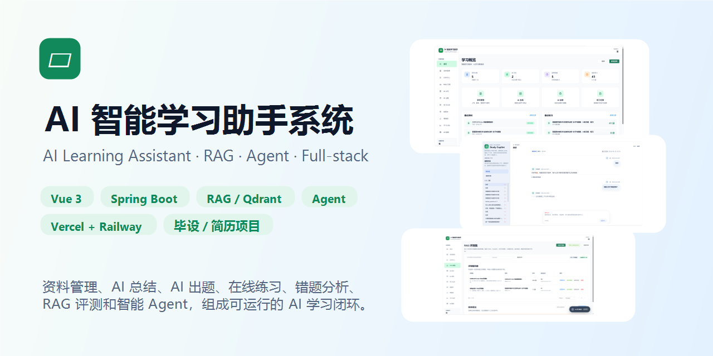
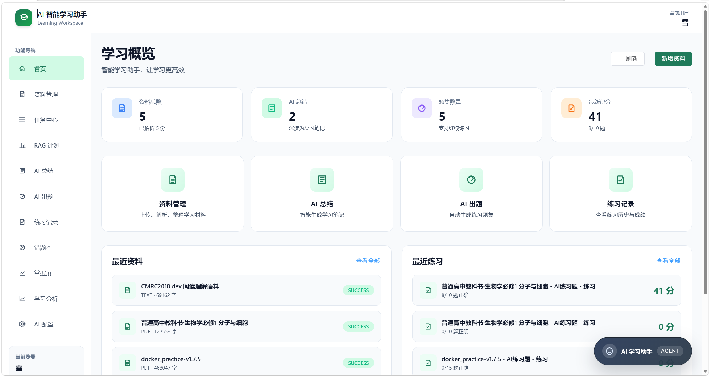
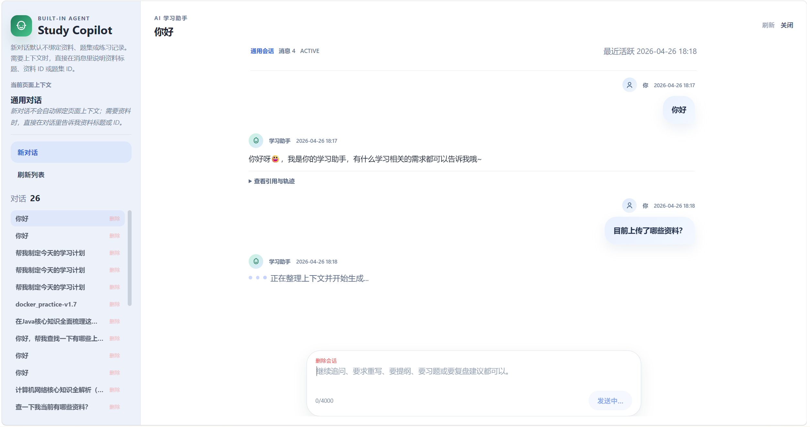
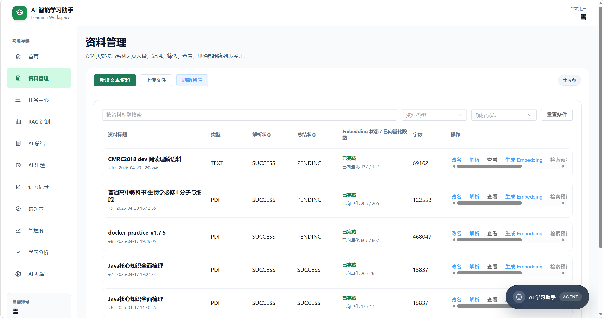
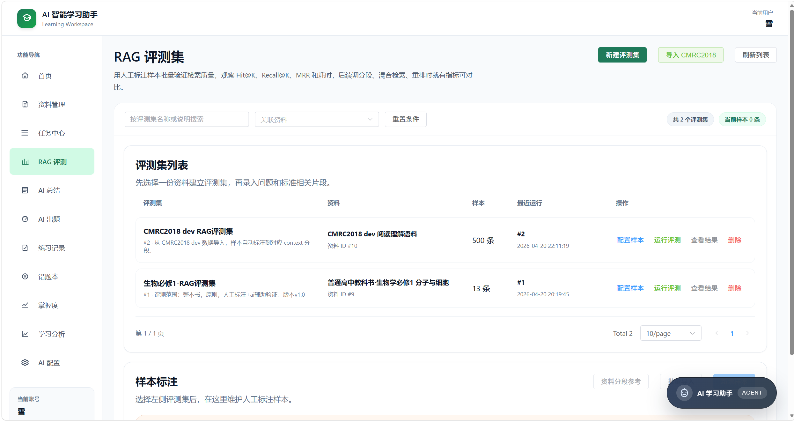
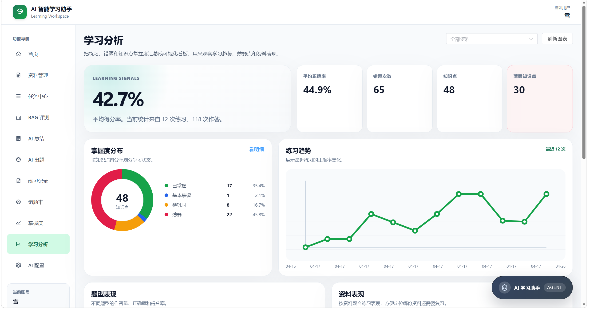
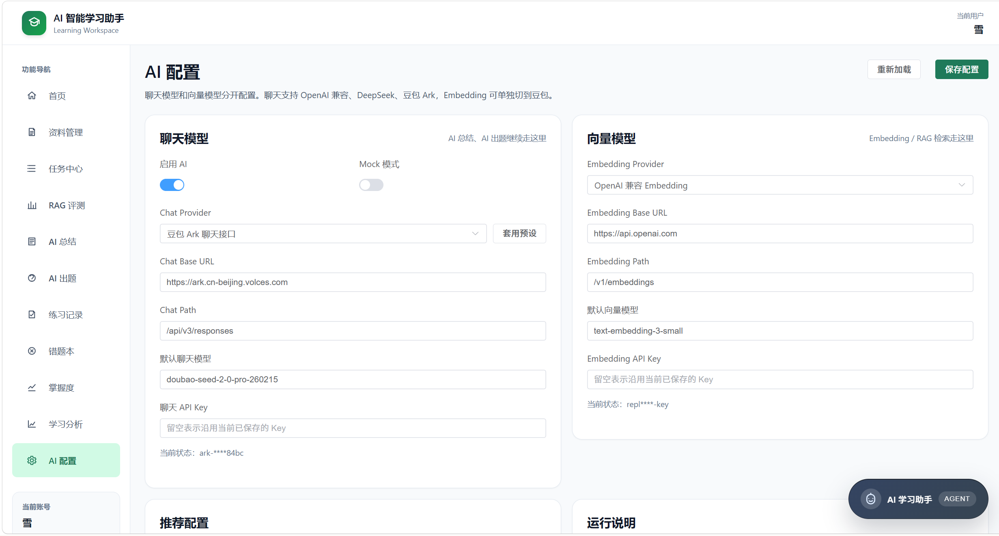

# AI 智能学习助手系统

> 一个围绕“资料管理 -> RAG 检索 -> AI 总结/出题 -> 在线练习 -> 错题复盘 -> 学习分析 -> Agent 学习助手”构建的全栈 AI 学习闭环项目。  
> 适合作为 **AI 应用实战、RAG 工程化、Agent 工具调用、毕业设计、课程设计、简历项目** 的参考案例。




## 联系方式
如有对本项目有问题，建议，可发送邮件至：`3111471949@qq.com`
> 注：广告、推广信息恕不回复，邮件请备注「AI学习系统+来意」


## 在线体验
  注意:中国用户需要使用vpn以访问
- 前端 Demo：[https://ai-intelligent-learning-assistant-s.vercel.app](https://ai-intelligent-learning-assistant-s.vercel.app)
- 后端健康检查：[https://backend-production-d1f3.up.railway.app/api/health](https://backend-production-d1f3.up.railway.app/api/health)
- GitHub 仓库：[https://github.com/Nyx-Amanises/AI-Intelligent-Learning-Assistant-System](https://github.com/Nyx-Amanises/AI-Intelligent-Learning-Assistant-System)

> 线上环境使用 Vercel + Railway 部署。首次访问时，如果后端处于冷启动状态，接口可能需要等待几秒。


## 项目截图

| 首页 / 学习概览 | Agent 学习助手 |
| --- | --- |
|  |  |

| 资料管理 | RAG 评测 |
| --- | --- |
|  |  |

| 学习分析 | AI 配置 |
| --- | --- |
|  |  |

## 核心能力

### 资料驱动学习闭环

- 上传或创建学习资料，支持 TXT / PDF / DOCX 等内容解析。
- 基于资料生成 AI 总结、复习提纲和练习题。
- 支持在线练习、自动判分、错题沉淀和知识点掌握度统计。
- 学习分析看板汇总正确率、错题数量、薄弱知识点和练习趋势。

### RAG 与向量检索

- 对资料内容进行分段和 Embedding。
- 使用 Qdrant 存储资料向量，支持语义检索。
- 支持 RAG 检索预览，展示相似度、页码、段落和章节信息。
- 内置 RAG 评测集管理，支持 Hit@K、Recall@K、MRR 和耗时统计。
- 支持导入 CMRC2018 数据集做批量检索质量验证。

### Agent 学习助手

- 支持通用学习对话和 SSE 流式回复。
- 支持会话列表、新建对话、删除对话和工具调用轨迹。
- 可查询资料、题集、练习记录、任务状态等系统上下文。
- 新对话默认不自动绑定资料，用户可在消息里主动指定资料标题或 ID。
- 打开 Agent 时会提示当前 AI 配置是否处于 Mock 模式。

### AI 配置与任务中心

- 支持 Chat 模型和 Embedding 模型分开配置。
- 支持 OpenAI-compatible、DeepSeek、豆包 Ark 等兼容接口。
- 支持 Mock 模式，便于无真实模型 Key 时演示系统流程。
- AI 总结、AI 出题、简答题判分、Embedding 等耗时操作统一进入任务中心。
- 任务中心支持状态追踪、详情查看、失败重试、重新派发和删除记录。

## 技术栈

| 层级 | 技术 |
| --- | --- |
| 前端 | Vue 3, TypeScript, Vite, Pinia, Vue Router, Element Plus, Axios |
| 后端 | Spring Boot 3.3, Java 17, MyBatis Plus, JWT, Bean Validation |
| 数据库 | MySQL 8, Redis |
| RAG | Qdrant, Embedding API, 资料分段, Hit@K / Recall@K / MRR 评测 |
| AI | OpenAI-compatible Chat API, SSE 流式输出, Mock 模式 |
| 部署 | Docker Compose, Vercel, Railway |


## 目录结构

```text
AI-Intelligent-Learning-Assistant-System
├─ backend/                  # Spring Boot 后端
│  ├─ src/main/java/          # 业务代码
│  ├─ src/main/resources/     # 配置文件
│  └─ Dockerfile
├─ frontend/                 # Vue 3 前端
│  ├─ src/api/                # 接口封装
│  ├─ src/components/         # 通用组件
│  ├─ src/views/              # 页面视图
│  └─ Dockerfile
├─ db/                        # 建表与迁移脚本
├─ docker/mysql/init/         # MySQL 容器初始化脚本
├─ docs/images/               # README 截图和社交预览图
├─ runtime/                   # AI 运行时配置，默认不提交敏感内容
├─ docker-compose.yml         # 本地一键启动
├─ vercel.json                # Vercel 前端部署配置
└─ README.md
```

## 快速启动

### 方式一：Docker Compose

1. 准备环境变量：

```powershell
Copy-Item .env.example .env
```

2. 启动全部服务：

```powershell
docker compose up -d --build
```

3. 访问服务：

- 前端：http://localhost:5173
- 后端：http://localhost:8083
- MySQL：localhost:3307
- Redis：localhost:6379
- Qdrant：http://localhost:6333

4. 查看日志：

```powershell
docker compose logs -f backend
docker compose logs -f frontend
```

5. 停止服务：

```powershell
docker compose down
```

### 方式二：本地手动启动

后端：

```powershell
Set-Location backend
mvn spring-boot:run
```

前端：

```powershell
Set-Location frontend
npm install
npm run dev
```

如果需要向量检索能力，请同时启动 Qdrant：

```powershell
docker run -d --name qdrant -p 6333:6333 -p 6334:6334 -v qdrant_storage:/qdrant/storage qdrant/qdrant
```

## 核心配置

后端支持通过环境变量覆盖配置：

| 变量 | 说明 |
| --- | --- |
| `SPRING_DATASOURCE_URL` | MySQL 连接地址 |
| `SPRING_DATASOURCE_USERNAME` | MySQL 用户名 |
| `SPRING_DATASOURCE_PASSWORD` | MySQL 密码 |
| `SPRING_REDIS_HOST` | Redis 地址 |
| `APP_AI_ENABLED` | 是否启用 AI 能力 |
| `APP_AI_MOCK_MODE` | 是否启用 Mock 模式 |
| `APP_AI_CHAT_PROVIDER_TYPE` | 聊天模型 Provider |
| `APP_AI_BASE_URL` | Chat API Base URL |
| `APP_AI_CHAT_PATH` | Chat API Path |
| `APP_AI_API_KEY` | Chat API Key |
| `APP_AI_DEFAULT_MODEL` | 默认聊天模型 |
| `APP_AI_EMBEDDING_BASE_URL` | Embedding API Base URL |
| `APP_AI_EMBEDDING_API_KEY` | Embedding API Key |
| `APP_AI_DEFAULT_EMBEDDING_MODEL` | 默认 Embedding 模型 |
| `APP_QDRANT_BASE_URL` | Qdrant 地址 |
| `APP_QDRANT_COLLECTION_NAME` | Qdrant Collection 名称 |
| `APP_JWT_SECRET` | JWT 密钥 |

AI 配置页面保存的运行时配置默认写入：

```text
runtime/ai-config.json
```

## 常用接口

| 模块 | 接口示例 |
| --- | --- |
| 认证 | `POST /api/auth/register`, `POST /api/auth/login`, `GET /api/user/profile` |
| 资料 | `POST /api/material/upload`, `GET /api/material/page`, `POST /api/material/{id}/parse` |
| AI 任务 | `POST /api/ai/tasks/material/{materialId}/summary`, `POST /api/ai/tasks/material/{materialId}/question-set` |
| 练习 | `POST /api/practice/start`, `POST /api/practice/submit`, `GET /api/practice/page` |
| 分析 | `GET /api/wrong-questions/page`, `GET /api/knowledge-mastery/overview`, `GET /api/learning-analytics/overview` |
| RAG | `GET /api/rag/material/{materialId}/retrieve-preview`, `POST /api/rag-eval/datasets/{datasetId}/run` |
| Agent | `POST /api/assistant/sessions`, `POST /api/assistant/sessions/{sessionId}/messages/stream` |

## 部署说明

当前线上部署方式：

- 前端：Vercel
- 后端：Railway
- 数据库与依赖：Railway / 外部托管服务

前端生产构建：

```powershell
Set-Location frontend
npm run build
```

后端生产构建：

```powershell
Set-Location backend
mvn -DskipTests package
```

Vercel 使用根目录的 `vercel.json`：

```json
{
  "installCommand": "cd frontend && npm ci",
  "buildCommand": "cd frontend && npm run build",
  "outputDirectory": "frontend/dist"
}
```

Railway 后端部署时，需要确保服务根目录指向 `backend`，并配置好 MySQL、Redis、Qdrant、AI Provider 和 JWT 相关环境变量。

## 后续规划

- 引入更完整的 Agent 工具编排和权限控制。
- 增加混合检索、重排模型和 RAG A/B 对比。
- 增加学习计划、间隔复习和个性化推荐。
- 增加模型调用成本统计和调用日志。
- 增加 GitHub Actions 自动化构建与部署。

## License

本项目用于学习、课程设计和作品集展示。若用于商业用途，请先确认依赖组件与模型服务的许可要求。
